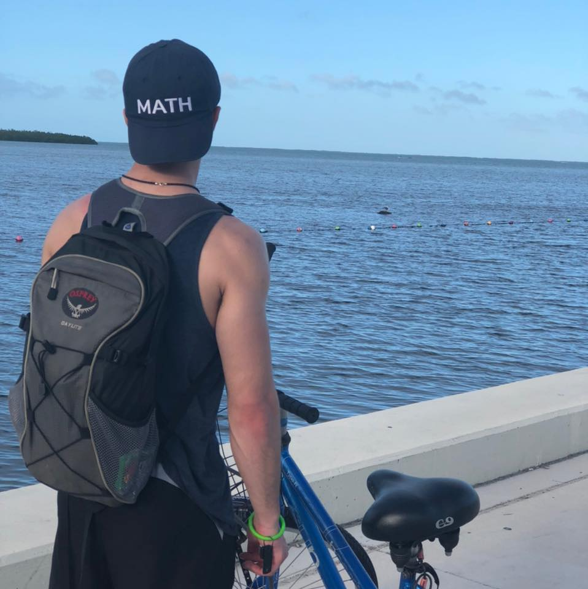

---

---

 
<link rel="stylesheet" href="styles.css" type="text/css">

Research and lab experience in PKPD modeling, biological colloids, and polymer chemistry. Currently on publications related to computational biology, ultrasound contrast agents, and body weight prediction software using image analysis.  Proficient in R, R Shiny, C++, HTML, and Creo Parametrics. My programming experiences are often related to pharmacokinetic modeling and simulation (PBPK and PKPD) and R shiny app development, though I have also modeled anaerobic digestion (See [here](https://kylebarrett.github.io/AnaerobicDigestion/)). Looking forward, I plan to become more involved with software development, and learn more innovative modeling techniques for quantifying biochemical processes.

My full CV is available [here](files/Resume_new.pdf).